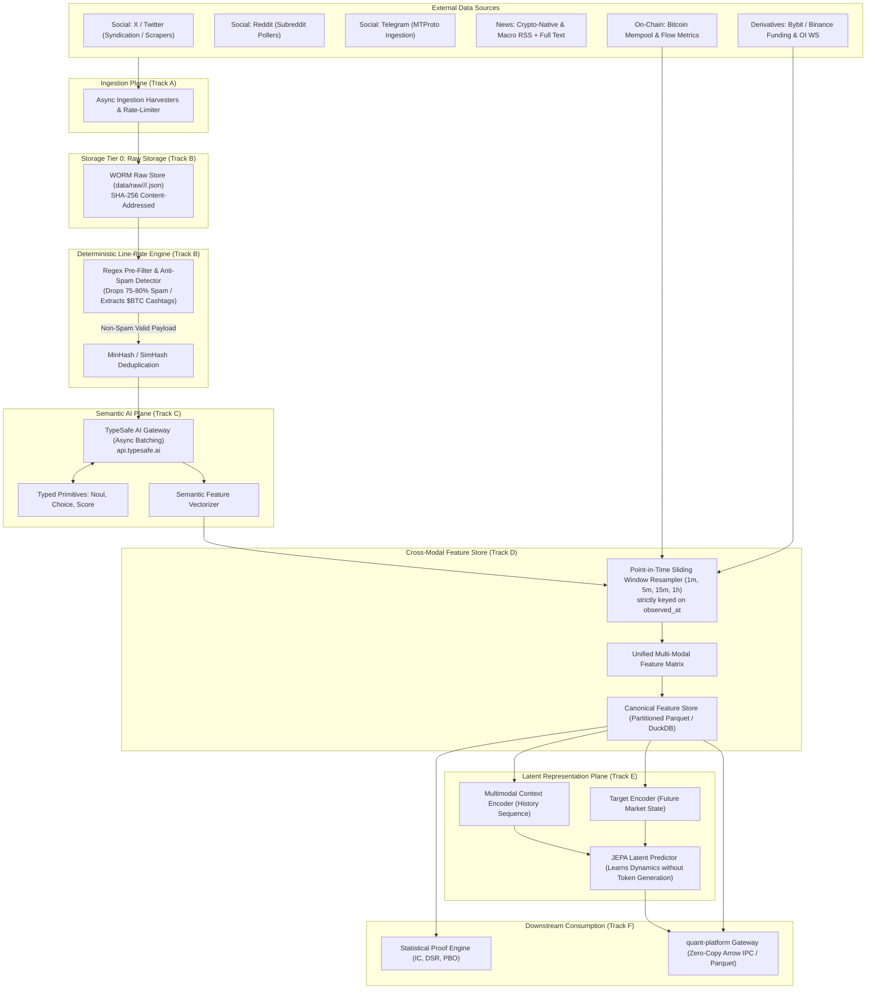

# TARGET_ARCHITECTURE.md

**Project:** BTC Multi-Modal Sentiment Engine (`Sentiment`)  
**Status:** DRAFT v0.1 — Target Architecture Specification  
**Architecture Target:** High-throughput, multi-modal market sentiment pipeline with line-rate filtering, structured semantic classification, self-supervised latent prediction, and strict temporal point-in-time correctness.

---

## 1. System-Level Topology



---

## 2. Storage Tiering & Data Lifecycles

The storage subsystem is organized into three distinct, immutable tiers:

```text
Tier 0: RAW (WORM)
  Format: Gzipped JSON/HTML blobs with original source bytes.
  Partitioning: data/raw/<source>/YYYY-MM-DD/<sha256_hash>.json.gz
  Invariant: Immutable, append-only. Never deleted or modified in-place.

Tier 1: CANONICAL DOCUMENTS
  Format: Partitioned Parquet tables validated against `CanonicalDocument` schema.
  Partitioning: data/canonical/<source>/year=YYYY/month=MM/part-*.parquet
  Attributes: Strict dual-timestamps (`published_at`, `observed_at`), extracted entities, clean text.

Tier 2: FEATURE STORE (CROSS-MODAL)
  Format: Columnar Parquet / DuckDB tables.
  Partitioning: data/features/resolution=<window>/year=YYYY/part-*.parquet
  Attributes: Resampled at 1m, 5m, 15m, 1h. Aligned with forward market outcomes.
```

---

## 3. The Multi-Stage Filtering Funnel

1. **Stage 1 (Line-Rate Deterministic Regex & Heuristics)**:
   * Rejects known spam signatures (giveaways, telegram phishing links, token launches, repetitive bot patterns).
   * Extracts target symbols (`$BTC`, `Bitcoin`, `WBTC`, `Sats`).
   * Cost: $\approx 0$ compute cost ($< 150 \mu s$ per payload).
   * Result: Drops 75% to 80% of raw social chatter.

2. **Stage 2 (TypeSafe AI Jev Semantic Typing)**:
   * Receives only valid, non-spam candidates.
   * Evaluates typed primitives:
     * `is_fud_or_rumor`: `Noul` $[0.0, 1.0]$
     * `is_market_moving`: `Noul` $[0.0, 1.0]$
     * `sentiment_polarity`: `Choice` (`EXTREME_BEARISH`, `BEARISH`, `NEUTRAL`, `BULLISH`, `EXTREME_BULLISH`)
     * `credibility_tier`: `Score` (`NOISE`, `COMMUNITY`, `REPUTABLE_ANALYST`, `TIER1_MEDIA_OR_OFFICIAL`)
     * `impact_urgency`: `Score` (`NEGLIGIBLE`, `LOW`, `MEDIUM`, `HIGH`, `CRITICAL`)
   * Cost: $\$0.042 / 1\text{M}$ input tokens (output tokens free).
   * Determinism: Strict typing, zero invalid JSON, zero hallucinated text.

3. **Stage 3 (Cross-Modal Fusion & Window Resampling)**:
   * Aggregates document sentiment scores over rolling time buckets $[t_0, t_1]$.
   * Fuses sentiment intensity and sentiment momentum with:
     * BTC Perpetual Funding Rate & Open Interest delta (Bybit/Binance).
     * Mempool fee acceleration and whale volume (Mempool/On-Chain).

4. **Stage 4 (JEPA Latent Predictive Representation)**:
   * **Context Encoder**: Encodes the historical sequence of multimodal states $X_{t-k:t}$ into latent space $s_t \in \mathbb{R}^d$.
   * **Target Encoder**: Encodes the actual observed market transition at $t+\Delta t$ (e.g. forward price volatility and returns).
   * **Predictor**: Predicts $\hat{s}_{t+\Delta t} = P(s_t, \Delta t)$.
   * Loss function: Mean squared error in latent space regularized with VICReg variance/covariance terms to prevent representational collapse.

---

## 4. Point-in-Time Correctness & Anti-Lookahead Contract

* **The Problem**: Social posts and news articles often feature timestamps that disagree with reality (e.g., edited articles, retroactively scraped tweets, or delayed network ingestion).
* **The Invariant**: All downstream aggregations and model trainings are keyed strictly on `observed_at`.
* If an event with `published_at = 12:00:00` is ingested by our scraper at `observed_at = 12:04:30`:
  * It **cannot** participate in any feature window closing at `12:01:00`, `12:02:00`, `12:03:00`, or `12:04:00`.
  * It enters the feature store strictly in the $[12:04:00 - 12:05:00]$ window.
  * This strictly guarantees zero lookahead leakage into historical backtests.

---

## 5. Downstream Integration with `quant-platform`

The platform exposes features through a clean, decoupled boundary:
* **Parquet Feature Artifacts**: Written directly to shared storage using identical metadata standards as `quant-platform`'s `FeatureArtifact v1`.
* **Zero-Copy Arrow Streaming**: Fast IPC streams for live trade decision loops.
* **Feature Schema**: Compatible with `quant-platform`'s `FeatureDefinition` specification.
