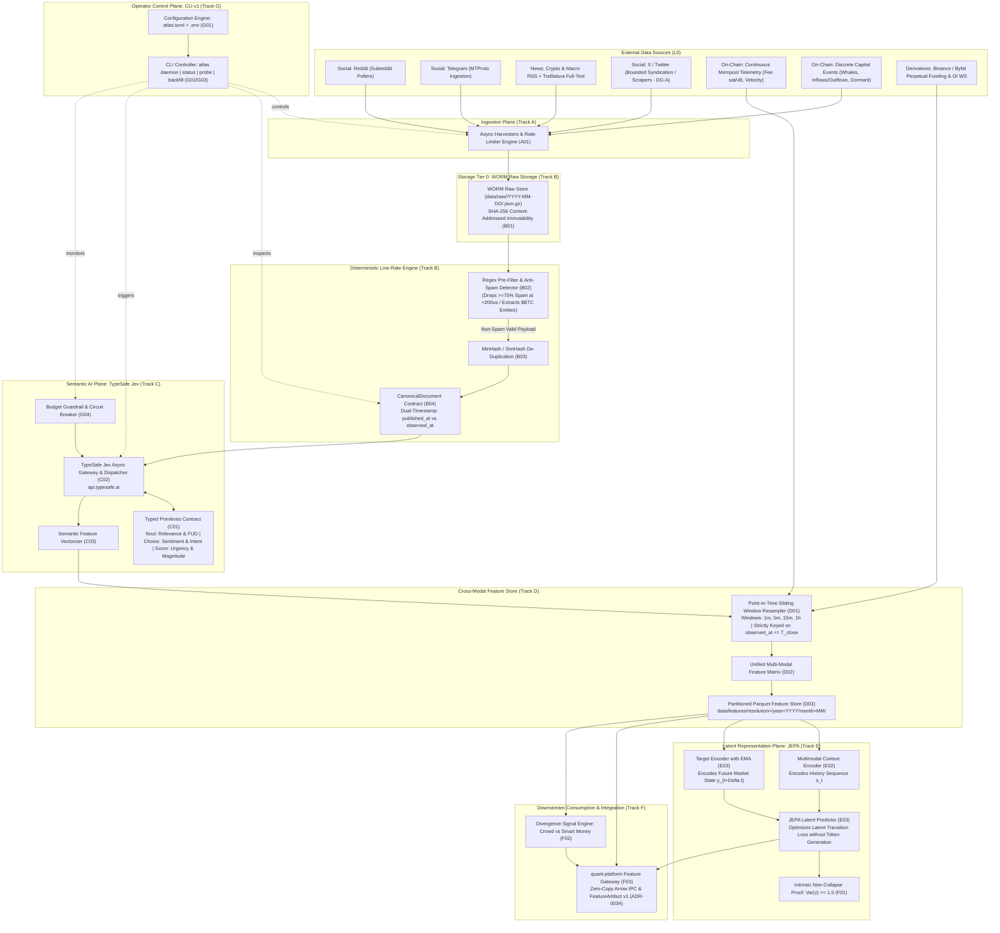

# TARGET_ARCHITECTURE.md

**Project:** Atlas (BTC Multi-Modal Sentiment & Latent Representation Engine)  
**Status:** CANONICAL BASELINE v1.0 — Architecture Specification  
**Architecture Target:** High-throughput, multi-modal market sentiment pipeline with line-rate regex pre-filtering, structured semantic typing (TypeSafe Jev), dual-channel on-chain intent analysis, self-supervised latent prediction (JEPA), CLI operator control, and strict temporal point-in-time correctness.

---

## 1. System-Level Topology



---

## 2. Storage Tiering & Data Lifecycles

Atlas enforces a strict three-tier physical storage lifecycle:

```text
Tier 0: RAW STORAGE (WORM - Write Once, Read Many)
  Format: Gzipped JSON/HTML blobs with original raw wire bytes.
  Path: data/raw/<source>/YYYY-MM-DD/<sha256_hash>.json.gz
  Invariant: Append-only, content-addressed, immutable. Never modified in-place.
  Purpose: Enables deterministic historical replay whenever regex rules or semantic prompts evolve.

Tier 1: CANONICAL STORAGE
  Format: Partitioned Parquet tables conforming to `sentiment/canonical-document@1`.
  Path: data/canonical/<source>/year=YYYY/month=MM/part-*.parquet
  Attributes: Enforces dual timestamps (`published_at`, `observed_at`), clean sanitized text, 
              and deterministic regex metadata.

Tier 2: CROSS-MODAL FEATURE STORE
  Format: Highly compressed, columnar Parquet tables queryable via DuckDB.
  Path: data/features/resolution=<window>/year=YYYY/month=MM/part-*.parquet
  Attributes: Uniform time-indexed records ($1m, 5m, 15m, 1h$) containing fused text sentiment,
              on-chain intent scores, mempool velocity, derivatives metrics, and latent JEPA vectors.
```

---

## 3. The Cascading Funnel Architecture

To achieve high throughput while maintaining an operational compute cost under **€25/month**, Atlas processes external data through an aggressive multi-stage filtering funnel:

### Stage 1: Line-Rate Deterministic Regex & Heuristics (L1)
* **Execution**: Pre-compiled Python/C regex suite processing incoming text in $< 200 \mu s$ per payload.
* **Responsibilities**:
  1. *Spam & Botnet Suppression*: Identifies giveaway bot templates, airdrop phishing links, and copy-paste telegram shilling.
  2. *Symbol & Entity Disambiguation*: Extracts `$BTC`, `Bitcoin`, `WBTC`, `Sats`, Layer-2 mentions (`Lightning`, `Stacks`), and regulatory entities.
  3. *Noise Dropping*: Rejects $\ge 75\%$ of raw social chatter before any AI compute is invoked.

### Stage 2: Structured Semantic Typing via TypeSafe AI Jev (L2)
* **Execution**: High-speed, non-generative System-One classification via `typesafe-sdk`.
* **Cost**: $\$0.042 / 1\text{M}$ input tokens (output tokens free).
* **Guarantees**: Zero hallucinated text, zero malformed JSON, and deterministic schema adherence:
  * *Text Sentiment*: Polarity (`Choice`), Credibility Tier (`Score`), Market Urgency (`Score`), Relevance & FUD (`Noul`).
  * *On-Chain Capital Intent*: Flow Intent (`Choice`: exchange dump, cold storage accumulation, internal custody rebalancing), Immediate Sell Pressure (`Noul`), Capital Magnitude (`Score`).

### Stage 3: Dual-Channel On-Chain & Microstructure Fusion (L3)
* **Continuous Metrics**: Mempool fee rates (sat/vB), fee velocity, and derivatives funding rates / Open Interest stream continuously into time-window aggregation buckets.
* **Discrete Capital Movements**: Whale transfers and exchange flows (typed by Jev in Stage 2) are aggregated into net volume and intent scores.
* **Point-in-Time Windowing**: Resamples all signals into $1m, 5m, 15m, 1h$ buckets strictly keyed on $\text{observed\_at} \le T_{\text{window\_close}}$.

### Stage 4: Joint Embedding Predictive Architecture — JEPA (L4)
* **Philosophy**: Replaces conversational LLM inference with self-supervised representation learning over time-series state spaces.
* **Context Encoder**: Encodes the rolling history of fused multimodal features $X_{t-k:t}$ into latent representation space $s_t \in \mathbb{R}^d$.
* **Target Encoder**: Encodes the observed forward market state $y_{t+\Delta t}$ using an Exponential Moving Average (EMA) of network weights.
* **Predictor**: Learns to predict the latent representation $\hat{s}_{t+\Delta t} = P(s_t, \Delta t)$ without token-level generation.
* **Loss Function**: Mean Squared Error in latent space constrained by VICReg variance/covariance regularizers to prevent representational collapse.

---

## 4. Point-in-Time Correctness & Anti-Lookahead Guarantee

Social media timestamps and edited news wire releases are notoriously unreliable. A publication timestamp (`published_at`) declared as `14:00:00 UTC` may only be ingested and verified by the system at `14:04:15 UTC` (`observed_at`).

### The Invariant Rule:
$$\text{Document } D \in \text{Window}[T_0, T_1] \iff T_0 < D.\text{observed\_at} \le T_1$$

* If $D.\text{published\_at} \le T_1$ but $D.\text{observed\_at} > T_1$, the document is **strictly excluded** from Window $[T_0, T_1]$ and postponed to the window containing its `observed_at`.
* This mathematical invariant guarantees that historical backtests run inside `quant-platform` can never suffer from lookahead bias or retroactive data leakage.

---

## 5. Operator Control Plane (CLI v1)

The system is managed through a single authoritative command-line entrypoint (`atlas`) backed by declarative configuration:

```text
atlas
├── daemon
│   ├── start [--sources ...]  <- Spawns async harvesting and processing workers
│   ├── stop                   <- Graceful shutdown with in-flight flush
│   └── status                 <- Renders live table of connectors, throughput, lag, and budget
├── probe --text "..."         <- Dry-run trace across Regex L1 -> Jev L2 -> SemanticVector
├── backfill --from ... --to   <- Historical backfill over archive feeds
└── export --res 1h --out ...  <- Generates quant-platform FeatureArtifact Parquet package
```

### Budget Protection & Circuit Breaker (G04):
The operator declares maximum daily token expenditure in `atlas.toml` (e.g., `max_daily_token_spend_usd = 1.50`).  
An internal token-bucket monitor tracks live usage against `api.typesafe.ai`. If the daily threshold is breached, the circuit breaker automatically disengages Jev API calls and transitions Atlas into **"Regex-Only Mode"**, ensuring the system never runs up unexpected cloud bills.

---

## 6. Integration Contract with `quant-platform`

The boundary between `Atlas` and `quant-platform` is decoupled, zero-copy, and artifact-based:

1. **Artifact Format**: Atlas exports partitioned Parquet files matching `quant-platform`'s `FeatureArtifact v1` specification (`ADR-0034`).
2. **Metadata Contract**: Every exported partition includes a deterministic manifest detailing source lineage, dual-timestamp coverage, and schema version (`sentiment/feature-artifact@1`).
3. **Downstream Execution**: `quant-platform` imports the feature artifacts directly into its `FeatureSet` catalog, computing Information Coefficient (IC), Event Studies, and strategy weights without executing any scraping or text parsing.
