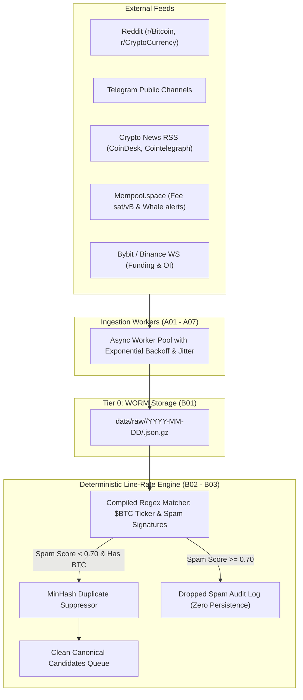

# Wave 1: Ingestion Plane & Deterministic Line-Rate Engine

- **Status:** **READY TO OPEN**
- **Governed Atoms:**
  - `A01` (Scraper Resilience & Rate-Limit Engine)
  - `A02` (Social Connector: Reddit)
  - `A03` (Social Connector: Telegram)
  - `A04` (Social Connector: X / Twitter — Gated on DG-A)
  - `A05` (News & Regulatory Feed Harvester)
  - `A06` (On-Chain Bitcoin Mempool & Capital Flow Monitor — Dual Stream)
  - `A07` (Derivatives Microstructure Monitor)
  - `B01` (WORM Raw Storage Tier)
  - `B02` (High-Throughput Regex Engine)
  - `B03` (Anti-Sybil & Duplicate Filter)
- **Prerequisite Gate:** Wave 0 closed (`cbff8a4` on `main`).
- **Target Integration Branch:** `implement/wave-1`

---

## 1. Objective & Bounding Rules

Implement the high-throughput, fault-tolerant ingestion data plane and the zero-compute deterministic line-rate filtering engine:

1. **Harvesting (L0)**: Build asynchronous pollers and streaming connectors for Reddit, Telegram, Crypto/Macro News (RSS + Trafilatura), On-Chain Mempool/Whale alerts, and Derivatives WebSocket feeds.
2. **WORM Raw Storage (Tier 0)**: Persist all incoming wire payloads in append-only gzipped JSON blobs indexed by SHA-256 digests.
3. **Deterministic Filtering (L1)**: Construct a compiled, high-speed Regex engine executing in $< 200 \mu s$ per payload, extracting `$BTC` entity mentions and rejecting $\ge 75\%$ of social spam/botnet noise.
4. **Anti-Sybil Deduplication**: Deploy MinHash near-duplicate filtering across a sliding 60-minute window to eliminate social copy-pasta.

### Explicit Wave 1 Non-Goals:
- Do **NOT** invoke TypeSafe Jev API calls in Wave 1 (Jev integration is bounded to Wave 2).
- Do **NOT** implement the sliding-window time-resampler (Feature Store is bounded to Wave 3).
- Do **NOT** build the JEPA neural network (bounded to Wave 4).

---

## 2. Technical Architecture & Component Flow

---

## 3. Bounded Implementation Tasks

### Task 1.1: WORM Raw Storage Engine (`B01`)
* Module: `src/atlas/storage/worm_store.py`
* Append-only writer saving wire bytes to `data/raw/<source>/<YYYY-MM-DD>/<sha256>.json.gz`.
* Verification: File write immutability and exact SHA-256 digest recalculation test.

### Task 1.2: High-Throughput Regex Engine (`B02`)
* Module: `src/atlas/processing/regex_filter.py`
* Features:
  * Symbol patterns: `(?i)(?:\$BTC\b|\bBitcoin\b|\bWBTC\b|\bSats\b|\bLightning\s*Network\b)`.
  * Spam signatures: Giveaway bots, airdrop phishing (`t.me/claim`), referral shill phrases, token pumps.
  * Line-rate benchmark: $< 200 \mu s$ per 280-character payload ($> 5,000$ payloads/sec on single core).

### Task 1.3: Anti-Sybil MinHash Deduplicator (`B03`)
* Module: `src/atlas/processing/dedup.py`
* Sliding 60-minute in-memory MinHash/SimHash ring buffer rejecting duplicate tweets/posts with Jaccard similarity $> 0.85$.

### Task 1.4: Resilient Harvesting Framework (`A01`)
* Module: `src/atlas/ingestion/base.py` & `src/atlas/ingestion/resilience.py`
* Exponential backoff, jitter, proxy rotation hook, and HTTP 429/403 backoff policies.

### Task 1.5: News & Regulatory Harvester (`A05`)
* Module: `src/atlas/ingestion/news_harvester.py`
* Asynchronous RSS polling + Trafilatura full-text article extraction.

### Task 1.6: Social Harvesters (`A02` Reddit, `A03` Telegram)
* Modules: `src/atlas/ingestion/reddit_harvester.py`, `src/atlas/ingestion/telegram_harvester.py`.

### Task 1.7: On-Chain Mempool & Derivatives Feed (`A06`, `A07`)
* Modules: `src/atlas/ingestion/mempool_harvester.py`, `src/atlas/ingestion/derivatives_streamer.py`.

---

## 4. Golden E2E Proof Specification

- **Proof Document:** `docs/integration/WAVE1_GOLDEN_E2E_DETERMINISTIC_INGESTION.md`
- **Proof Runner:** `tools/wave1_golden_e2e.py`
- **Test Corpus:** `fixtures/wave1_corpus_1000_frozen.json` (500 legitimate crypto news/analysis items + 500 real spam/botnet posts).
- **Acceptance Criteria**:
  1. **Throughput**: Regex engine processes the 1,000 items in $< 200$ ms.
  2. **Spam Rejection**: Rejects $\ge 75\%$ of the spam population (precision $\ge 90\%$).
  3. **Legitimate Preservation**: Zero false drops on Tier-1 news and high-signal analyst posts.
  4. **WORM Integrity**: 100% of incoming payloads written to WORM storage with verifiable SHA-256 digests.
