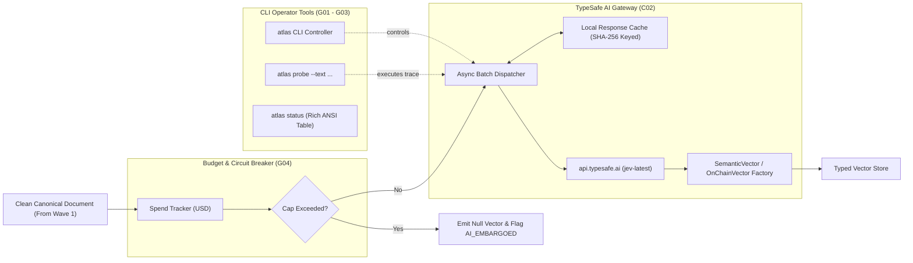

# Wave 2: Semantic Typing & Operator Control Plane (CLI v1)

- **Status:** **PLANNED**
- **Governed Atoms:**
  - `C02` (Jev Async Gateway & Dispatcher)
  - `G01` (Configuration Engine: `atlas.toml` + `.env`)
  - `G02` (CLI Runtime Controller: `atlas`)
  - `G03` (Pipeline Probe & Diagnostic Tool: `atlas probe`)
  - `G04` (Budget Guardrail & Circuit Breaker)
- **Prerequisite Gate:** Wave 1 Golden Proof verified on `main`.
- **Target Integration Branch:** `implement/wave-2`

---

## 1. Objective & Bounding Rules

Implement the semantic AI inference plane via TypeSafe AI's Jev System-One model, and build the canonical operator CLI tool (`atlas`) with automated budget guardrails:

1. **Jev Gateway (`C02`)**: Connect to `api.typesafe.ai` using `typesafe-sdk`, featuring async batching, connection pooling, and local sqlite/duckdb response caching.
2. **Dual-Topology Evaluation**:
   * Evaluate narrative news/social items against `JEV_NARRATIVE_QUESTIONS` $\to$ `SemanticVector`.
   * Evaluate discrete on-chain whale transactions against `JEV_ONCHAIN_QUESTIONS` $\to$ `OnChainSemanticVector`.
3. **Operator CLI Tool (`G01`, `G02`, `G03`)**: Provide the authoritative `atlas` command-line interface supporting `daemon`, `status`, `probe`, and `backfill`.
4. **Hard Budget Circuit Breaker (`G04`)**: Track daily and monthly dollar expenditure; automatically disengage Jev API calls upon exceeding the cap, falling back to Regex-only mode.

### Explicit Wave 2 Non-Goals:
- Do **NOT** build the time-window resampler (Feature Store is Wave 3).
- Do **NOT** train the JEPA model (Wave 4).

---

## 2. Technical Architecture

---

## 3. Bounded Implementation Tasks

### Task 2.1: Configuration Engine (`G01`)
* Module: `src/atlas/config.py`
* Pydantic-based parser loading `atlas.toml` and `.env` with strict type validation.

### Task 2.2: Hard Budget Circuit Breaker (`G04`)
* Module: `src/atlas/semantic/budget.py`
* Thread-safe token spend ledger; tracks dollar cost based on $\$0.042 / 1\text{M}$ input tokens. Automatically trips when daily threshold is reached.

### Task 2.3: TypeSafe Jev Async Gateway (`C02`)
* Module: `src/atlas/semantic/jev_gateway.py`
* Non-blocking HTTP client using `typesafe-sdk`, retries with exponential backoff on 429s, and content-hash caching to prevent re-evaluating duplicate text.

### Task 2.4: Operator CLI (`G02`, `G03`)
* Module: `src/atlas/cli.py`
* Implements `atlas daemon`, `atlas status`, and `atlas probe` using `click` and `rich`.

---

## 4. Golden E2E Proof Specification

- **Proof Document:** `docs/integration/WAVE2_GOLDEN_E2E_JEV_AND_CLI_OPERATOR.md`
- **Proof Runner:** `tools/wave2_golden_e2e.py`
- **Acceptance Criteria**:
  1. Evaluates 500 narrative posts and 100 on-chain whale transactions with $100\%$ schema conformity.
  2. Interactive probe: `atlas probe --text "..."` outputs structured Rich tables matching schema in $< 600$ ms.
  3. Circuit breaker verification: Mocking spend past daily cap immediately engages fallback and emits `ERR_CIRCUIT_TRIPPED` without crash.
