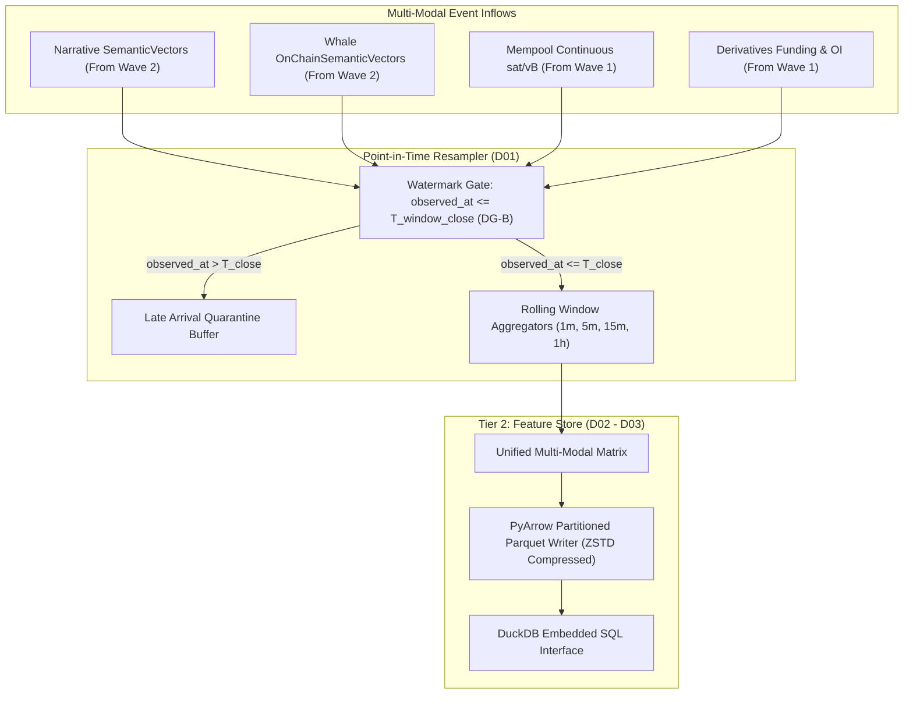

# Wave 3: Multi-Modal Fusion & Point-in-Time Feature Store

- **Status:** **PLANNED**
- **Governed Atoms:**
  - `D01` (Time-Window Resampler: Point-in-Time)
  - `D02` (Cross-Modal Feature Matrix)
  - `D03` (Canonical Parquet Materialization)
- **Decision Gates Resolved:** `DG-B` (Late-arrival re-indexing and watermark threshold).
- **Prerequisite Gate:** Wave 2 Golden Proof verified on `main`.
- **Target Integration Branch:** `implement/wave-3`

---

## 1. Objective & Bounding Rules

Construct the temporal point-in-time feature store that unifies narrative sentiment, on-chain whale intent, mempool pressure, and derivatives microstructure into high-speed columnar Parquet tables:

1. **Anti-Lookahead Resampler (`D01`)**: Resample asynchronous multi-modal streams into discrete time windows ($1m, 5m, 15m, 1h$) strictly enforcing the mathematical invariant:
   $$\text{Event } E \in \text{Window}[T_0, T_1] \iff T_0 < E.\text{observed\_at} \le T_1$$
2. **Cross-Modal Matrix Synthesis (`D02`)**: Combine Jev sentiment aggregates, social volume, mempool fee velocity, whale flow intent scores, and Binance/Bybit Funding Rate / Open Interest into unified tabular records.
3. **Partitioned Parquet Store (`D03`)**: Materialize feature tables partitioned by resolution and date (`data/features/resolution=<res>/year=<YYYY>/month=<MM>/`), fully indexed for zero-copy DuckDB / PyArrow analytics.

### Explicit Wave 3 Non-Goals:
- Do **NOT** train the JEPA neural network (Wave 4).
- Do **NOT** implement the final export adapter to `quant-platform` (Wave 5).

---

## 2. Technical Architecture & Invariant Enforcement

---

## 3. Bounded Implementation Tasks

### Task 3.1: Resolution & Watermarking Policy (`D01` / `DG-B`)
* Module: `src/atlas/features/resampler.py`
* Implements rolling window logic enforcing monotonic watermarks. If an item arrives with `published_at < T_open` but `observed_at \in [T_open, T_close]`, it is placed strictly in $[T_{\text{open}}, T_{\text{close}}]$.

### Task 3.2: Multi-Modal Aggregation Kernels (`D02`)
* Module: `src/atlas/features/matrix.py`
* Vectorized aggregation functions: volume counts, credibility-weighted sentiment mean, FUD intensity, net whale intent score, mempool fee acceleration, and funding rate snapshots.

### Task 3.3: Parquet Partitioning & Materialization (`D03`)
* Module: `src/atlas/features/store.py`
* PyArrow schema persistence writing partitioned Parquet datasets with metadata manifests.

---

## 4. Golden E2E Proof Specification

- **Proof Document:** `docs/integration/WAVE3_GOLDEN_E2E_MULTIMODAL_FUSION.md`
- **Proof Runner:** `tools/wave3_golden_e2e.py`
- **Acceptance Criteria**:
  1. **Zero Lookahead Leakage**: Verification script scans 100,000 synthetic multi-modal events; proves zero rows where $\text{observed\_at} > T_{\text{close}}$ participated in earlier windows.
  2. **Schema Adherence**: Materialized Parquet tables match `docs/contracts/FEATURE_ARTIFACT_EXPORT.md` exactly.
  3. **Scan Performance**: DuckDB runs aggregation queries over 1 month of 1m feature data in $< 50$ ms.
