# Wave 5: quant-platform Gateway & Divergence Signals

- **Status:** **PLANNED**
- **Governed Atoms:**
  - `F02` (Divergence Signal Engine)
  - `F03` (quant-platform Feature Gateway)
- **Prerequisite Gate:** Wave 4 Golden Proof verified on `main`.
- **Target Integration Branch:** `implement/wave-5`

---

## 1. Objective & Bounding Rules

Deliver the formal bridge connecting Atlas to `quant-platform`, packaging verified sentiment and latent state features into production artifacts:

1. **Divergence Signal Engine (`F02`)**: Implement rule-based detection identifying extreme dislocations between retail crowd emotion (social sentiment) and smart money reality (on-chain whale accumulation/dumping + derivatives positioning).
2. **quant-platform Export Adapter (`F03`)**: Implement zero-copy export producing partitioned Parquet datasets strictly conforming to `quant-platform`'s `FeatureArtifact v1` specification ([`ADR-0034`](file:///D:/Documents/Active/quant-platform/docs/architecture/ADR-0034-feature-artifact-v1.md)).
3. **End-to-End Handover Verification**: Verify that `quant-platform` can import, scan, and inspect Atlas feature partitions within its research and outcome engine.

### Explicit Wave 5 Non-Goals:
- Do **NOT** execute strategies or calculate trading PnL inside Atlas. Execution and strategy evaluation remain strictly the sovereign responsibility of `quant-platform`.

---

## 2. Technical Architecture & Gateway Contract

```mermaid
flowchart LR
    subgraph AtlasEngine ["Atlas Engine (Source of Truth)"]
        FeatureStore["Tier 2 Feature Store (From Wave 3)"]
        JEPALatent["JEPA Latent Representations (From Wave 4)"]
        DivergenceEngine["Divergence Detector (F02)"]
    end

    subgraph ExportGateway ["Feature Gateway (F03)"]
        ExportCLI["atlas export --resolution 1h --out ..."]
        ArtifactBuilder["FeatureArtifact v1 Builder (ADR-0034)"]
        ManifestGenerator["DatasetManifest v2 Generator"]
        ParquetPackage["Exported Parquet Package"]
    end

    subgraph QuantPlatform ["quant-platform (Consumer & Arbitrator)"]
        FeatureCatalog["FeatureSet Catalog (ADR-0026)"]
        OutcomeEngine["Outcome Engine (ADR-0038)"]
        AlphaProof["DSR / PBO Validation Suite (ADR-0037)"]
    end

    FeatureStore & JEPALatent --> DivergenceEngine
    DivergenceEngine --> ExportCLI
    ExportCLI --> ArtifactBuilder
    ArtifactBuilder --> ManifestGenerator
    ManifestGenerator --> ParquetPackage
    ParquetPackage --> FeatureCatalog
    FeatureCatalog --> OutcomeEngine
    OutcomeEngine --> AlphaProof
```

---

## 3. Bounded Implementation Tasks

### Task 5.1: Divergence Signal Engine (`F02`)
* Module: `src/atlas/features/divergence.py`
* Detects market dislocations:
  * *Bullish Divergence*: Extreme crowd panic (social polarity $< -0.6$) accompanied by heavy institutional accumulation (net whale score $> +0.7$) and negative funding rates (short squeeze setup).
  * *Bearish Divergence*: Retail euphoria (social polarity $> +0.7$) while whales are dumping to exchanges and funding rates are deeply positive.

### Task 5.2: `quant-platform` FeatureArtifact Adapter (`F03`)
* Module: `src/atlas/integration/quant_platform_gateway.py`
* Maps internal tables to `quant_platform.feature.FeatureArtifact` schema bytes, generating compliant manifest files.

### Task 5.3: CLI Export Command (`G02` Extension)
* Exposes `atlas export` with date bounds, resolution flags, and integrity checksum generation.

---

## 4. Golden E2E Proof Specification

- **Proof Document:** `docs/integration/WAVE5_GOLDEN_E2E_QUANT_PLATFORM_GATEWAY.md`
- **Proof Runner:** `tools/wave5_golden_e2e.py`
- **Acceptance Criteria**:
  1. **Artifact Conformity**: Exported Parquet packages pass 100% of schema checks against `quant-platform`'s `FeatureArtifact v1`.
  2. **End-to-End Replay in quant-platform**: A proof script executing inside `quant-platform` successfully loads Atlas features and demonstrates statistical Information Coefficient (IC) evaluation without schema or timestamp errors.
  3. **Zero Lookahead Attestation**: Formal check verifies that all feature timestamps align strictly to closed bar windows.
